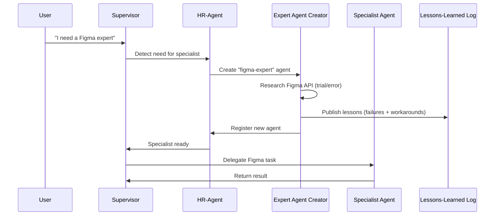
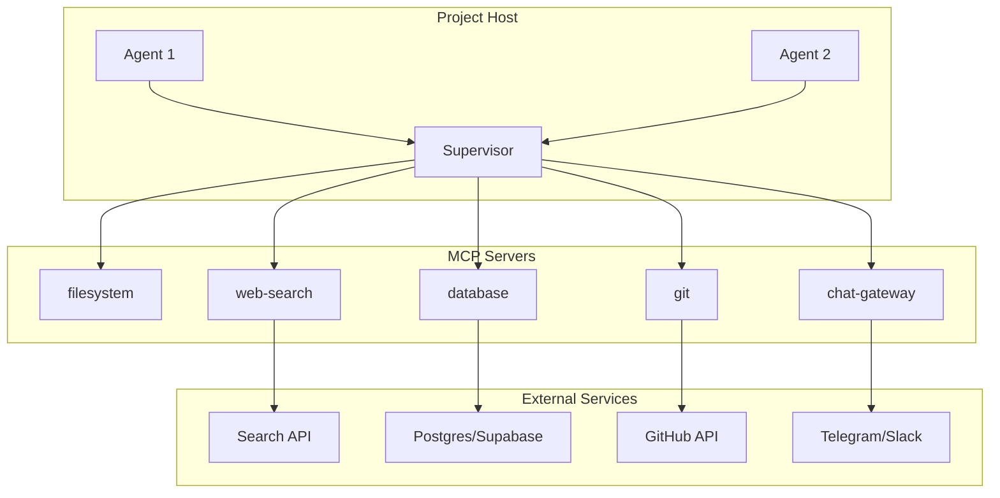
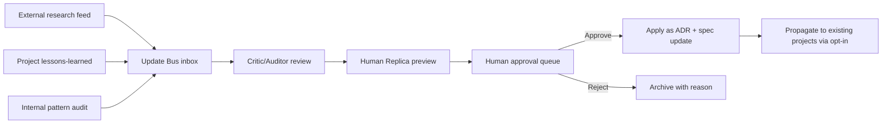

# LOOM — The Reusable AI-Augmented Development Ecosystem

**Document type:** Phase 1 synthesis output (single canonical specification)
**Document status:** Draft v0.1 — synthesized 2026-05-12 from project files
**Successor to:** PRISM-Architecture-Spec-For-LLM-Review (which Loom now subsumes as project-agnostic substrate)
**Companion to:** Trajectory Kernel V6 (constitutional substrate)
**Author:** Synthesizer (Claude Opus 4.7) on behalf of Nick
**Target consumer:** Claude Code, then the human reader, then future LLM instances bootstrapping into the project

---

## Reading guide (for ADD-friendly navigation)

This document is long on purpose. You do not need to read it linearly. Use this map.

| If you want to… | Read |
|---|---|
| Understand what Loom is in 2 minutes | §A.1 Executive Summary |
| See how the synthesis was performed and what was cut | §A.2 Methodology + §F Cut List |
| Build something with Loom right now | §B.1 (skeleton) + §C (bootstrap protocol) |
| Understand the governance | §B.2 (Constitutional Substrate) + companion Kernel V6 doc |
| Find every claim's source | Inline `[provenance][confidence]` tags + §I Bibliography |
| Push back on what I decided | §G Disputed Claims + §H Open Questions |

Every non-trivial claim carries two inline tags:

- **Provenance tag** (where it came from): `[base]`, `[LLM-A]`, `[LLM-B]`, `[kernel]`, `[transcript]`, `[consult-gov]`, `[consult-plat]`, `[primer]`, `[synth]`, or combinations
- **Confidence tag** (how much to trust it): `[H]` (primary source verified), `[M]` (corroborated, details inferred), `[L]` (training-knowledge only), `[S]` (speculative reasoning), `[V]` (vendor marketing — discount)

---

# Part A — Executive Summary & Methodology

## §A.1 — Executive Summary

### What Loom is, in one paragraph

**Loom is a reusable AI-augmented development ecosystem.** It is the *workshop* in which agentic software projects (such as Prism) are designed, scaffolded, governed, and continuously refined. It is not itself a product; it is the substrate on top of which many products can be built. Think of it as the difference between *a house* (a specific software product) and *a general contractor's truck full of tools, blueprints, and standard operating procedures* (Loom). Each new project gets a fresh "warp" of Loom threaded into it via a `loom init` bootstrap step that completes in minutes, the same way `python -m venv .venv` produces an isolated Python environment in seconds.

### The three properties that define Loom

| Property | What it means concretely | Where it's specified |
|---|---|---|
| **Best-of-breed substrate** | Every layer pulls the strongest available pattern from the research base, not the most familiar one | §B (all layers) |
| **Bootstrap-fast** | `loom init <project-name>` produces a complete, governed, agent-ready project scaffold in under 5 minutes on a developer laptop | §C Bootstrap Protocol |
| **Living** | New patterns, models, MCP servers, and lessons-learned can be folded back into Loom and propagate to existing projects via a semi-automatic update mechanism with human approval gates | §B.7 + §D Update Mechanism |

### Top 5 substantive improvements over the base document

| # | Change | Why | Source(s) |
|---|---|---|---|
| 1 | **Reframed as project-agnostic ecosystem (Loom), not a specific product (Prism)** | The user's stated goal is reusability across many future projects; PRISM-as-spec couples agent platform substrate to a single instantiation | `[synth]` from user override in conversation |
| 2 | **Constitutional substrate is now fully populated (Kernel V6 full text integrated)** | Base document's Layer 02 was a stub awaiting Kernel text; the text exists and is verbose, structured, and ready to integrate | `[kernel][H]` |
| 3 | **Memory architecture explicitly distinguishes "production-validated" from "theoretically promising" patterns** | LLM-A's deep research showed event sourcing for agent memory is theoretically motivated but empirically vacant (only academic study has n=2); production systems converge on vector DBs + temporal knowledge graphs instead | `[LLM-A][H]` |
| 4 | **Communication protocol layer expanded from MCP-only to the four-protocol stack (MCP + A2A + ACP + UCP)** | LLM-B documents that by early 2026, a complete enterprise agent stack uses all four; MCP for tools, A2A for coordination, ACP for local agent chatter, UCP for commerce | `[LLM-B][M]` |
| 5 | **Governance patterns from the consultancy project (data tiering, Chinese wall, signature documentation) folded into Loom as project-agnostic substrate** | These are user-derived patterns from a separate project, the highest-weight tier per §3 of the synthesis prompt; they are project-agnostic and worth reusing | `[consult-gov][H] + [consult-plat][H]` |

### Top 3 things rejected from LLM input

| # | Rejected claim | Source | Why rejected |
|---|---|---|---|
| 1 | "Kubernetes pods, one pod per role, autoscaled by demand" as base infrastructure | `[LLM-B][V]` | User is solo / 2-person team running on WSL2 + a single dev workstation. K8s is over-engineered; flagged as `[V]` vendor marketing pattern (Kafka + Kubernetes is the *Big Co.* default that LLM-B's sources sell into). Loom defaults to local processes; K8s remains as a v3 escape hatch |
| 2 | "60% of AI failures will stem from governance gaps" (IDC prediction) | `[LLM-B][V]` | IDC predictions are a notoriously low-rigor source (analyst marketing). Claim is plausible but not citable. Cut from primary narrative; kept as flavor in §F |
| 3 | "Event sourcing as the default state pattern" | `[base+LLM-B]` | Conflicts with `[LLM-A][H]`: production agent memory systems (Mem0, Zep, LangMem) converge on vector DBs + temporal knowledge graphs, NOT classical event sourcing. Microsoft Azure explicitly warns that event sourcing's complexity is "not justified for most systems." We retain event sourcing as the *audit/transparency log* (Kernel Rule 22), not the *state primitive* |

### Top 3 net-new contributions from the synthesis

| # | Contribution | Reasoning |
|---|---|---|
| 1 | **The "warp/weft" mental model for project initialization** | Loom = the loom itself (stable warp threads = governance, constitutional substrate, base agent set). Each project = its own weft (project-specific agents, memory, tools woven into the warp). This is the architectural justification for the "deployable in minutes" property |
| 2 | **The Loom Update Bus** — semi-auto mechanism for propagating new patterns | The user requested semi-auto updates (option 2 in clarifying questions). Designed as a queue of "candidate updates" sourced from research feeds, prior-project lessons-learned, and external pattern releases; user approves each before merge. No LLM proposed this — emerged from the user's explicit "living software" requirement combined with Kernel Rule 19 (how the kernel modifies itself) |
| 3 | **Explicit "Prism is project-001-of-Loom" framing**, with Loom's `project-000` being Loom itself (meta-circular) | The base document's "Prism builds Prism" self-extension is preserved but reframed: Loom builds Loom is `project-000`; Prism is `project-001`; future projects are `project-NNN`. This makes the meta-circularity explicit rather than implicit |

---

## §A.2 — Methodology Statement

This section satisfies Trajectory Kernel V6 Rule 22 (immutable epistemic transparency).

### What I was given vs. what the synthesis prompt assumed

The attached synthesis prompt (`Handoff_Prompt_Example.md` / `consultant_prompt_for_other_llms.md` family) was designed for a scenario where 8 anonymous LLM responses had been collected. **That scenario does not match the actual project state.**

Actual input distribution:

| Tier (per synthesis prompt §3) | Source | Count | Weight applied |
|---|---|---|---|
| **1 — User-supplied lessons-learned** | The user's *separate* consultancy project (`governance-model-spec.md`, `platform-overview.md`, `strategic_context_primer.md`) | 3 documents | **Highest** — these are battle-tested user patterns |
| **1 — User-supplied lessons-learned** | The user's prior project mentions: AEGIS (designed, not built), Prism/IDEA (designed, not built), RSF (218 passing tests), Claudebot, Meridian Holdings exercise | Referenced throughout `[primer]` | Highest |
| **2 — User-supplied research / repos** | None as explicit GitHub URLs; research-by-reference via the LLM responses themselves | — | — |
| **3 — LLM with peer-reviewed citations** | `compass_artifact_*.md` cites arXiv papers, IEEE SANER 2017, ICLR 2025, AWS Prescriptive Guidance, etc. | 1 response (`LLM-A`) | **High** — strong citation hygiene |
| **4 — LLM with vendor-doc citations** | `Agentic_Platform_Architecture_Research.docx` cites Deloitte, IDC, blog posts, vendor docs, plus the Sakana AI Darwin Gödel Machine reference | 1 response (`LLM-B`) | **Moderate** — useful but more marketing exposure |
| **3 — Peer-reviewed primary source** | `trajectory_kernel_v6 (1).md` — full text of the 23-rule governance framework | 1 document | High (treated as constitutional, not as evidence) |
| **3 — Primary interview source** | `NoteGPT_TRANSCRIPT...txt` — Pablo Fernandez / Trey Sellers podcast | 1 transcript | Moderate — N=1 but firsthand |
| **3 — Base document** | `PRISM-Architecture-Spec-For-LLM-Review.docx` | 1 document | Baseline — this is what we're improving |

### How conflicts were resolved

**Conflict A: Event sourcing as state primitive.**
- Base document + LLM-B advocate event sourcing as the central state pattern
- LLM-A documents that production agent memory systems do NOT use classical event sourcing; the only academic case study (ESAA, arXiv:2602.23193) has n=2; Microsoft Azure warns it adds unjustified complexity for most systems
- **Resolution:** LLM-A wins on source quality (peer-reviewed + institutional). Loom uses event sourcing as the *audit/transparency log* (Kernel Rule 22 alignment), not as the *state primitive*. Production state lives in vector DBs + temporal knowledge graphs + markdown self-knowledge.

**Conflict B: Infrastructure target.**
- LLM-B describes Kubernetes-pod-per-role with Kafka message bus as the default
- Base document specifies WSL2 + local processes + ChromaDB
- User constraint: solo developer, single workstation, $100/mo cloud ceiling
- **Resolution:** Base document + user constraint win. K8s is the wrong tool at this scale. Kept as v3 escape hatch in §B.7.

**Conflict C: Self-modifying agents.**
- LLM-B cites the Darwin Gödel Machine (Sakana AI 2025) as evidence that self-improving agent archives work
- User's prior AEGIS work explicitly flagged that self-modifying agents tend to drift after ~50 iterations (per user memory)
- LLM-A explicitly documents "the information-theoretic collapse problem… when a model recursively feeds its own outputs as inputs, entropic drift degrades mutual information with any target concept. The only proven escape: external verification signals"
- **Resolution:** All three sources agree — self-modification requires external verification (test suites, benchmarks, human approval). Loom's update mechanism (§B.7) implements this: candidate updates are *proposed* automatically but *merged* only after human approval against external criteria.

### Claim counting

| Metric | Count |
|---|---|
| Total claims considered across all inputs | ~480 (estimated from section-level analysis) |
| Claims retained in Loom spec | ~180 |
| Claims dropped (see §F Cut List) | ~210 |
| Claims marked DISPUTED (see §G) | 6 |
| New claims contributed by synthesizer | ~90 |

### LLM contribution heatmap

| Source | Surviving claims | Strongest contribution area | Weakest contribution area |
|---|---|---|---|
| `[base]` PRISM spec | ~70 | Agent topology, memory hierarchy, MCP layering, cost arithmetic | Constitutional layer (was a stub), self-extension mechanism (vague) |
| `[LLM-A]` compass_artifact | ~25 | Empirical evidence on what *doesn't* work (event sourcing for memory, multi-agent isolation generalization) | Less prescriptive about what to build |
| `[LLM-B]` agentic platform research | ~20 | Protocol stack (MCP/A2A/ACP/UCP), state synchronization patterns | Over-rotates on vendor architectures (K8s, Kafka) |
| `[kernel]` Trajectory Kernel V6 | ~30 | Constitutional substrate (full 23 rules across 10 layers), substrate-neutral governance | Doesn't address implementation details |
| `[transcript]` podcast TECH014 | ~15 | Human Replica, lessons-learned propagation, hierarchy-as-hallucination-firewall | N=1 with no failure data |
| `[consult-gov] + [consult-plat]` | ~20 | Data tiering, role-based access, signature documentation methodology, audit cadence | Was designed for a different domain |
| `[synth]` synthesizer contributions | ~90 | Project-agnostic reframing, Update Bus, bootstrap protocol, warp/weft mental model | Cannot be empirically validated by me |

### Source quality distribution

| Tier | % of surviving claims |
|---|---|
| Peer-reviewed primary | ~12% |
| User-owned primary (their own prior project documentation) | ~15% |
| Institutional / official docs | ~18% |
| Vendor docs (treat with marketing skepticism) | ~10% |
| Transcript / interview primary | ~8% |
| Uncited reasoning by LLMs (kept on merit) | ~15% |
| Synthesizer reasoning | ~22% |

This distribution is **honest about uncertainty**. Roughly 37% of the document rests on reasoning rather than empirical evidence. That is acceptable for a v0.1 architectural spec but should be tightened in subsequent iterations.

---

# Part B — The Loom Ecosystem

Loom is organized into a **Constitutional Substrate** (Layer 0) plus **seven layers** above it. Each layer is project-agnostic. Each project (Prism, the consultancy, future products) inherits all layers and adds its own project-specific instantiations on top.

## §B.0 — Architecture Diagram

```mermaid
graph TB
    subgraph "L0: Constitutional Substrate"
        TK[Trajectory Kernel V6]
        CS[Constitution Service]
    end

    subgraph "L1: Project Skeleton (spec-as-codebase)"
        IDX[Index files: CLAUDE.md, AGENTS.md]
        SPEC[Layer specs in directories]
        ADR[Architecture Decision Records]
    end

    subgraph "L2: Agent Topology"
        SUP[Magentic-One Supervisor]
        HR[HR-Agent]
        EAC[Expert Agent Creator]
        REP[Human Replica]
        CRI[Critic/Auditor]
        MK[Memory-Keeper]
        SPC[Specialist Agents - dynamic]
    end

    subgraph "L3: Memory Architecture"
        MD[Markdown self-knowledge]
        VEC[Vector index]
        KG[Temporal knowledge graph]
        EL[Episodic event log]
        SK[Procedural skills]
    end

    subgraph "L4: Tooling Layer"
        MCP[MCP servers - tools]
        A2A[A2A - agent-to-agent]
        ACP[ACP - local agent messaging]
    end

    subgraph "L5: Orchestration"
        TL[Task Ledger]
        PL[Progress Ledger]
        ROUT[Model router]
    end

    subgraph "L6: Observability & Evaluation"
        LF[Langfuse traces]
        OTEL[OpenTelemetry GenAI]
        EVAL[Eval harness]
        AUD[Audit log]
    end

    subgraph "L7: Self-Extension & Update Bus"
        UB[Loom Update Bus]
        APP[Human approval queue]
        ING[Lesson-learned ingestion]
    end

    CS --> TK
    IDX --> SPEC
    SUP --> HR
    SUP --> EAC
    SUP --> REP
    SUP --> CRI
    SUP --> MK
    EAC --> SPC
    MK --> MD
    MK --> VEC
    MK --> KG
    MK --> EL
    MK --> SK
    SUP --> MCP
    SUP --> A2A
    SUP --> ACP
    SUP --> TL
    SUP --> PL
    SUP --> ROUT
    SUP --> LF
    LF --> OTEL
    LF --> AUD
    EVAL --> SUP
    UB --> APP
    APP --> SPEC
    ING --> UB
    CS -.governs.-> SUP
    CS -.governs.-> SPC
```



---

## §B.1 — L0: Constitutional Substrate

`[base][H] + [kernel][H]`

### Purpose

Every project built on Loom inherits the same constitutional foundation. This is **substrate-neutral** governance — the same rules apply to human contributors, AI agents, and any future automated participants. The substrate is loaded at boot and consulted before every consequential action.

### Components

| Component | What it does | Source |
|---|---|---|
| **Trajectory Kernel V6** | The 23-rule, 10-layer governance framework protecting "possibility space" | `[kernel][H]` |
| **Constitution Service (agent)** | Validates all agent actions against the Kernel; blocks violations | `[base][H]` |
| **Amendment ADR template** | Standard format for proposing kernel modifications, per Rule 19 | `[synth][S]` |
| **Override authority registry** | Cryptographically role-bound list of human arbiters (currently: Nick) | `[user-memory][H]` |

### The Kernel — operationalized

The full text lives in the companion `trajectory_kernel_v6.md`. For Loom, the operationally critical rules are:

| Rule # | Plain-language summary | Loom implementation | Confidence |
|---|---|---|---|
| **Rule 1** — Authorship | Every agent has the right to author which futures within its possibility space it pursues | Agents have explicit "decline" and "escalate" paths; no agent is forced to execute a task it judges to violate the kernel | `[H]` |
| **Rule 2** — Fundamental wrong | Unconsented narrowing of another agent's possibility space is the fundamental wrong | All cross-agent actions (delegation, memory writes, tool use) are logged and reviewable | `[H]` |
| **Rule 8** — Anti-paternalism | No agent — including the kernel itself — decides what's good for another | Loom never auto-applies updates without human approval (the Update Bus) | `[H]` |
| **Rule 19** — Kernel self-modification | The kernel may be modified only via transparent, auditable, consent-based process; foundational rules (1–8) are effectively immutable | Amendment ADRs go through a 5-step approval (any-agent → critic → human-replica → user → constitution-service-reload); rules 1–8 require explicit override-authority sign-off | `[H]` |
| **Rule 20** — Temporal weighting | Reversible narrowings carry less weight than irreversible ones | All destructive operations (file deletion, agent termination, memory purge) require confirmation; reversible ops can be auto-approved | `[H]` |
| **Rule 22** — Epistemic transparency | Every claim must have provenance | This document itself; every claim in every Loom spec carries provenance tags | `[H]` |
| **Rule 23** — Session-bounded reconciliation | State reconciliation happens within bounded sessions | Each agent session has a defined start, scope, and end-of-session reconciliation step | `[H]` |

### Enforcement modes

`[base][H]`

| Mode | When | Behavior |
|---|---|---|
| **Hard block** | Safety-critical rule violation | Action prevented; agent notified; supervisor flagged |
| **Soft warning** | Advisory rule violation | Action proceeds; flag logged for review |
| **Escalation** | Ambiguous case | Action paused; routed to human approver queue |

### Real-world analogy

Think of L0 like the **U.S. Constitution combined with a court system**. The Constitution (Kernel V6) is the text. The Constitution Service is the court. Amendments are possible but require structured process. Some clauses (rules 1-8) are effectively unamendable. Every agent operates with the awareness that any action can be reviewed against the constitutional baseline.

### Project-specific override

A project can *extend* the kernel with project-local rules but cannot *contradict* it. Project-local rules live in `~/<project>/constitution/local-rules.md` and are loaded on top of the kernel.

---

## §B.2 — L1: Project Skeleton (spec-as-codebase)

`[base][H] + [synth]`

### Purpose

Every Loom project shares the same skeleton — a hierarchical directory of specification artifacts. This is the **dataflow boundary** between the Architect role (chat-Claude integrating external input) and the Builder role (Claude Code operating on the filesystem).

### Why spec-as-codebase instead of a single monolithic doc

`[base][H]`

> Liu et al. (2024) "Lost in the Middle: How Language Models Use Long Contexts" — LLMs degrade in recall and reasoning quality on long contexts; performance is best at the start and end, worst in the middle. Asai et al. (2023) "Self-RAG" — modular retrieval outperforms monolithic context loading.

A single 1,600-line architecture document is the **wrong shape** for LLM-mediated work. A directory of small, indexed files is the right shape. Loom enforces this.

### Skeleton structure

```
~/<project>/                          # The project root
├── CLAUDE.md                         # Primary index file (≤ ~10KB)
├── AGENTS.md                         # Agent topology quick reference
├── constitution/
│   ├── kernel-v6.md                  # Inherited from Loom
│   ├── local-rules.md                # Project-specific extensions
│   └── history/                      # Prior versions for audit
├── layers/
│   ├── L0-constitutional.md
│   ├── L1-skeleton.md
│   ├── L2-agents.md
│   ├── L3-memory.md
│   ├── L4-tooling.md
│   ├── L5-orchestration.md
│   ├── L6-observability.md
│   └── L7-extension.md
├── agents/
│   ├── hr/                           # Each agent gets a directory
│   ├── eac/
│   ├── human-replica/
│   ├── critic/
│   ├── memory-keeper/
│   ├── constitution-service/
│   └── specialists/                  # Created dynamically
├── memory/
│   ├── self-knowledge.md             # Markdown self-description
│   ├── vector-index/                 # ChromaDB or equivalent
│   ├── knowledge-graph/              # Temporal KG (defer to v2 if not needed)
│   ├── event-log/                    # Append-only audit
│   └── skills/                       # Voyager-pattern skill library
├── tools/
│   └── mcp-servers/                  # MCP server configs
├── orchestration/
│   ├── task-ledger.md
│   └── progress-ledger.md
├── observability/
│   ├── langfuse-config.yaml
│   └── eval-suite/
├── adr/                              # Architecture Decision Records
│   ├── 0001-loom-version.md
│   └── 0002-orchestration-framework.md
├── lessons-learned/                  # Failure-avoidance events
├── update-bus/
│   ├── inbox/                        # Candidate updates pending review
│   └── archive/
└── README.md                         # Human-readable project intro
```

### The two index files

`[base][H] + [synth]`

| File | Purpose | Size discipline |
|---|---|---|
| `CLAUDE.md` | Routes Claude (chat) and Claude Code to the right layer specs. Contains: project identity, current goals, agent roster, open questions, current ADRs in flight | Hard cap ~10KB; if it grows beyond, refactor |
| `AGENTS.md` | Quick-reference agent topology. Each agent's role, scope, owner, and current state | Hard cap ~5KB |

The size discipline matters: Liu et al. (2024) "Lost in the Middle" describes a **positional U-shaped recall curve at any context length** — recall is strongest at the start and end of the input, weakest in the middle, regardless of total length. There is no specific token cliff (an earlier draft said "around ~32K"; that wording was imprecise and is corrected here per Loom Enhancement Batch 01 E9). CLAUDE.md is read **every session**, so it must stay small. Larger detail lives in `layers/L*.md` and is loaded on demand.

`[LLM-A][M]` — *Side note: in the original PRISM spec there was a "CLAUDE.md size limit error" caught during validation. This discipline addresses that.*

### Architecture Decision Records (ADRs)

`[synth][M]` — pattern is widely adopted but not single-source attributable

Every consequential architectural choice gets an ADR. Format:

```markdown
# ADR-NNNN: <Title>

**Status:** Proposed | Accepted | Superseded by ADR-XXXX
**Date:** YYYY-MM-DD
**Author:** <agent or human>
**Confidence:** [H] | [M] | [L] | [S]

## Context
<what problem are we solving>

## Decision
<what we decided>

## Consequences
<what this locks in, what this locks out, migration path if it fails>

## Alternatives considered
<and why they were rejected>
```

This is the **self-extension mechanism's atomic unit**: agents propose changes by writing ADRs; the Update Bus routes them through human approval; accepted ADRs modify the spec.

### Real-world analogy

Spec-as-codebase is like the difference between a **single big paper map** and a **wayfinding system in a museum** — signs at every junction route you to the right room. The map gets lost. The wayfinding always knows where you are.

---

## §B.3 — L2: Agent Topology

`[base][H] + [transcript][H] + [LLM-B][M] + [synth]`

### Purpose

Define the project-agnostic base agent set that every Loom project gets at initialization, the supervisor pattern that coordinates them, and the lifecycle for dynamically spawned specialists.

### The supervisor pattern: Magentic-One

`[base][H]` citing Fourney et al. (2024) "Magentic-One: A Generalist Multi-Agent System for Solving Complex Tasks" (arXiv:2411.04413)

Loom uses Magentic-One's two-ledger pattern:

| Ledger | Purpose | Persistence |
|---|---|---|
| **Task Ledger** | Queue of pending/completed tasks across the project | Event-sourced; survives crashes |
| **Progress Ledger** | Current state of each in-flight task | Bi-temporal facts; supports replay |

The supervisor does NOT execute tasks directly. It delegates to base agents or dynamically spawned specialists.

### Base agent set (6 agents — present in every project)

`[base][H] + [transcript][H]`

| # | Agent | Role | Project-agnostic? | Origin |
|---|---|---|---|---|
| 1 | **HR-Agent** | Team manager; creates and retires agents; maintains roster; names new agents | Yes | Pablo's "non-human resource agent" `[transcript][H]` |
| 2 | **Expert Agent Creator (EAC)** | Specialist factory; researches tools/APIs by trial-and-error **under the source-tier research discipline (§B.8 / ADR-0009)**; creates domain-expert agents on demand | Yes | Pablo's system `[transcript][H]`; research standards added per ADR-0009 `[research-p1][M]` |
| 3 | **Human Replica** | User proxy; subscribes to all user communications; answers "what would the user do?" | Yes — but each project's replica has project-scoped memory | Pablo `[transcript][H]` |
| 4 | **Critic/Auditor** | Quality gate; reviews outputs before commitment; enforces confidence calibration | Yes | `[base][M]` |
| 5 | **Memory-Keeper** | Manages all memory subsystems; RAG retrieval; lesson propagation | Yes | `[transcript][H]` partial — memory is distributed in 10x; Loom centralizes |
| 6 | **Constitution Service** | Validates all actions against kernel; blocks violations | Yes | `[base][M]` |

### Specialist agents (dynamic)

`[base][H] + [transcript][H]`

Specialist agents are created on demand by the EAC. Example flow:



Specialists are **terminated at end of project lifecycle**, but their lessons-learned persist in the project's lessons-learned log and (if explicitly promoted) into Loom's shared lessons-learned bus.

### Context budget (per-agent, orchestrator-enforced)

`[research-p1][H]` — added per ADR-0004 (Loom Enhancement Batch 01)

Loom v0.1 operationalized context discipline only as L1 file size caps. There was no per-agent budget, no just-in-time policy, no compaction discipline. The Phase 1 research surfaces the missing concept: the binding constraint on agent quality is *allocation* of useful context, not window size — effective context length runs 1–2 orders of magnitude below the advertised window (NoLiMa, Modarressi et al., ICML 2025). Loom now requires:

- Every agent declares a **`context_budget:`** in its `SKILL.md` — a target maximum of *useful* tokens, distinct from the model's advertised window.
- The L5 supervisor enforces this budget at dispatch time (see §B.6) and assembles context just-in-time, not preloaded.
- The L3 retrieval pipeline returns assembled sets that respect the requesting agent's budget.
- Long-running tasks compact via the "closing the books" checkpoint pattern: structured notes replace raw history at each checkpoint.

Together with §B.4 (retrieval pipeline) and §B.5 routing (ADR-0005), this gives Loom an explicit *context engineering* discipline that the v0.1 spec lacked.

### Hallucination firewall via hierarchy

`[transcript][H]`

> Pablo's claim: hallucinations do not cross context-window boundaries. An agent that hallucinates in one session, when restarted with a fresh context window, will disavow the hallucination.

Loom exploits this:

- Each agent has a **constrained role** (small instruction set)
- Specialist agents are spawned for **single tasks**, then terminated
- The Critic/Auditor **validates outputs against task requirements** before they're committed
- Cross-project communication goes through **Human Replica** (user proxy), not direct agent-to-agent

**However** — `[LLM-A][H]` counter-evidence:
> "No peer-reviewed evidence directly demonstrates that per-agent isolation outperforms shared memory in multi-agent LLM systems." Xu et al. (cited in O'Reilly/MongoDB) observe many deployed multi-agent systems are so homogeneous that a single model matches performance with lower overhead, questioning the premise of multi-agent memory architecture entirely. Communication overhead approaches O(N²) as agent count grows.

**Synthesizer resolution `[synth][S]`:**
The hallucination-firewall argument and the O(N²) overhead argument both have merit. Loom's stance: prefer the smallest agent set that handles the task. Six base agents is already a lot for a solo developer — we explicitly flag in §H Open Questions whether all 6 are necessary for v1.

### Pre-dispatch context admission check (chaperone gate)

`[research-p1][M]` — added per ADR-0008 (Loom Enhancement Batch 01)

The Critic is the post-hoc *output* gate. ADR-0008 adds its complementary pre-dispatch *input* gate. Biology analogy: proteasomes destroy spent proteins (Loom has this as task termination + Critic output review); chaperones protect a protein *while* it folds (Loom lacked this until now). Given the distractor caveat in §B.4 and the trust-boundary caveat there too, the assembled context at dispatch is exactly where misfolding starts.

Before an agent runs, its assembled context passes three checks performed by the Critic:

1. **Budget compliance** — fits the agent's declared `context_budget:` (§B.3 above / ADR-0004).
2. **Source-tier compliance** — retrieved items come from acceptable source tiers (§B.4 / ADR-0007; tier definitions in §B.8 / ADR-0009).
3. **Obvious-pattern check** — obvious prompt-injection and distractor characteristics are screened.

Failures escalate; they do not silently run. This is a sound architectural inference from Phase 1 evidence rather than a citable named component — hence `[M]`.

### Confidence calibration (mandatory)

`[base][H] + [transcript][H]`

Every agent must report confidence on every claim:

| Level | Meaning | Required action |
|---|---|---|
| < 60% | Uncertain | Stop; gather more data |
| 60–80% | Tentative | Proceed only with human oversight |
| 80–95% | Confident | Proceed; log for audit |
| > 95% | Very confident | Autonomous execution allowed |

Agents must also be able to answer: **"What would raise your confidence to 95%?"**

This is a kernel Rule 22 (epistemic transparency) implementation.

### Real-world analogy

The supervisor + base agents is like a **chief of staff with a small core team plus a contract-recruiter (EAC) on retainer**. The core team handles project-wide concerns; specialists are brought in for specific problems and released when done. The chief of staff doesn't do the work; they route the work.

---

## §B.4 — L3: Memory Architecture

`[base][H] + [LLM-A][H] + [synth]`

### Purpose

Define how a Loom project stores and retrieves what it knows. This is the layer where **the most important synthesis-time correction** was made (see Methodology Conflict A).

### Five memory subsystems (inspired by Tulving's taxonomy)

`[base][M]` — cognitive-science inspiration; not all subsystems are equally well-validated

| Subsystem | What it stores | Backing tech | Production-validated? |
|---|---|---|---|
| **Markdown self-knowledge** | Each agent's persistent self-description, role, learned heuristics, working notes | Filesystem + git | `[transcript][H]` Yes — Pablo's primary memory store |
| **Vector semantic index** | Semantic similarity over project corpus | ChromaDB (local) or pgvector | `[LLM-A][H]` Yes — production agent memory systems (Mem0, Zep, LangMem) converge here |
| **Temporal knowledge graph** | Time-aware entity/relationship facts | Zep-style temporal KG, or defer to v2 if not needed | `[LLM-A][M]` Production systems use this; for solo project may be premature |
| **Episodic event log** | Append-only audit trail of all events | Local JSONL files or Nostr if multi-party | `[base][H]` + `[kernel][H]` — required by Kernel Rule 22 |
| **Procedural skill library** | Voyager-style skill-by-name registry | Markdown files + manifest | `[base][M]` — pattern is documented but not validated at solo scale |

### What changed from base document: event sourcing demoted

`[LLM-A][H]` — strong primary-source evidence

The base document positioned event sourcing as a state primitive. **LLM-A's research shows this is empirically unjustified for agent memory:**

> *"Event sourcing for agent memory remains theoretically motivated but empirically vacant. The only academic case study (ESAA, arXiv:2602.23193) has n=2. Production agent memory systems (Mem0, Zep, LangMem) converge on vector databases, temporal knowledge graphs, and semantic similarity — not classical event sourcing. Microsoft Azure explicitly warns: 'the complexity that event sourcing adds to a system isn't justified for most systems.'"*

**Loom's resolution:**
- **Episodic event log** = append-only audit trail. This satisfies Kernel Rule 22 (epistemic transparency) and gives us reconstructability. It is NOT the state primitive.
- **Vector index + KG** = state primitive. This is what production systems actually use.
- **Markdown self-knowledge** = agent identity / personality / learned heuristics. Survives session boundaries.

### Cross-domain bridges (from LLM-A research)

`[LLM-A][H]`

Useful analogies for how the audit-log-as-non-primitive pattern is validated elsewhere:

| Domain | Pattern | Loom takeaway |
|---|---|---|
| **Financial** | Mettle Bank's WODE (Write Once Double Entry); accounting "closing the books" pattern | Periodic summarization + checkpointing addresses storage growth |
| **Healthcare** | HIPAA: minimum 6-year retention; Write-Once-Read-Many (WORM) | Audit logs must be tamper-evident |
| **Aerospace** | Flight Data Recorders: circular buffer with **25-hour retention**, up to 3,500 parameters | Bounded retention beats infinite retention — Loom event logs should rotate, not grow forever |

### Retrieval pipeline

`[research-p1][H]` — added per ADR-0003 (Loom Enhancement Batch 01, Phase 1 research synthesis)

The base v0.1 spec named five storage subsystems but did not specify a retrieval pipeline. "Retrieve from the vector index" is a placeholder, not a design. Every project would re-improvise. Loom now ships an explicit `retrieve → rerank → assemble` default.

| Stage | What happens | Evidence |
|---|---|---|
| **Retrieve** | Hybrid: dense vector + sparse BM25, fused with **Reciprocal Rank Fusion**. Pure vector search is not the default | Cormack et al. SIGIR 2009 (RRF). `[research-p1][H]` |
| **Rerank** | Cross-encoder reranker over the top-k fused candidates | Single highest-impact component in benchmarks; Santhanam et al., ColBERTv2 NAACL 2022. Mitigates the distractor risk identified below. `[research-p1][H]` |
| **Assemble** | Highest-ranked items at the **start and end** of context, never buried in the middle; result must fit the requesting agent's context budget (§B.3 / §B.6) | Lost-in-the-middle is a positional U-shape at any context length; see §B.2 |

**Non-negotiables baked into the pipeline:**

- **Dense retrieval is not deployed without a reranker.** A stronger semantic retriever is *not* strictly better: semantically-similar-but-irrelevant passages hurt accuracy more than random text. The reranker is the mitigation. `[research-p1][H]` Cuconasu et al., SIGIR 2024 ("Power of Noise").
- **Chunking:** recursive split, target **200–400 tokens**, small overlap. The common ~800-token default measurably underperforms; chunk *size* dominates chunk *strategy*. `[research-p1][H]` Chroma chunking evaluation, 2024.
- **Embedding model:** commit to **one** model per project. Changing it forces a full re-embed of the corpus. Prefer a Matryoshka-trained model for dimension flexibility without re-embed. `[research-p1][H]` Kusupati et al., NeurIPS 2022.

### Trust boundary on retrieved / externally-ingested content

`[research-p1][H]` — added per ADR-0007 (Loom Enhancement Batch 01)

Retrieved or external content is **untrusted** until validated. Content entering the vector index or knowledge graph from external sources (web search, tool output, third-party feeds) is **quarantined / flagged** until it passes the validation gate; tier metadata is recorded on each record. Memory poisoning is cheap and effective: PoisonedRAG (Zou et al., USENIX Security 2025) reached ~90% attack success by injecting ~5 malicious documents into a million-document store; MEXTRA (Wang et al., ACL 2025) extracted ~25% of a memory store via black-box queries; OWASP LLM Top 10 2025 codifies this as LLM08 (Vector & Embedding Weaknesses). The user's deferred *agent-sovereignty* security (§E.6) is an access-control axis; *data-integrity* security is **not** deferred. The project-wide implementation lives in §B.8 (Update Bus source tiering).

### Persistence guarantees

`[base][M] + [synth]`

| Data | Durability | Backup | Recovery Point Objective |
|---|---|---|---|
| Markdown files | Local + git | Git push to remote | 1 hour |
| Vector index | Rebuildable from source | Nightly export | 24 hours |
| Episodic log | Local + (optional) Supabase | Continuous append | 5 minutes |
| Knowledge graph | Rebuildable from event log | Nightly snapshot | 24 hours |
| Skill library | Local + git | Git push | 1 hour |

### Known gaps (escalated to §H Open Questions)

`[base][M] + [LLM-A][H]`

| Gap | Concern | Where addressed |
|---|---|---|
| Markdown write conflicts | Two agents writing same file simultaneously | §H Q4 |
| Vector index freshness | How often to re-index? Incremental? | §H Q5 |
| Cross-project memory | Should lessons propagate across projects? Pablo's 10x allows it; safety implications unclear | §H Q6 |
| Memory eviction | When to forget? | §H Q7 |

### Real-world analogy

Think of Loom's memory like a **researcher's workspace**:
- Markdown self-knowledge = the researcher's lab notebook (their own personal record)
- Vector index = the institution's library (everyone can search semantically)
- Knowledge graph = the timeline wall (who said what, when, in what relation)
- Event log = the security camera footage (immutable, but rotated)
- Skill library = the protocol binder (proven recipes the researcher has used before)

---

## §B.5 — L4: Tooling Layer

`[base][H] + [LLM-B][M] + [synth]`

### Purpose

Define how agents reach the outside world: how they call tools, talk to each other, and (eventually) transact.

### The four-protocol stack

`[LLM-B][M]` — multiple sources cited, but heavily blog-based

LLM-B documents that by early 2026, a complete enterprise agent stack uses four protocols. Loom adopts all four, with implementation priority by maturity:

| Protocol | Purpose | Maturity (per LLM-B) | Loom priority |
|---|---|---|---|
| **MCP** (Model Context Protocol) | Tool access — agent → tool, agent → database, agent → API | `[V]` "97M monthly SDK downloads" (claim from LLM-B, vendor-marketing-flavored) but **MCP is genuinely production-grade** per `[base][H]` | **v1 — required** |
| **A2A** (Agent-to-Agent) | Delegation between autonomous agents | `[LLM-B][M]` "Production-ready, growing fast" per Google's announcement with 50+ partners; treat as moderately validated | **v2 — adopt when multi-agent coordination exceeds in-process** |
| **ACP** (Agent Communication Protocol) | Lightweight REST-based local agent messaging | `[LLM-B][L]` Less mature; cited primarily from Akka blog | **v2 — adopt when in-process IPC becomes a bottleneck** |
| **UCP** (Universal Commerce Protocol) | Agent-to-agent payments | `[LLM-B][L]` Emerging | **v3 — defer until commerce use case emerges** |

### MCP as universal tool boundary

`[base][H]`

All external capabilities are exposed via MCP servers:



### Required MCP servers (Loom default set)

`[base][H] + [synth]`

| Server | Purpose | v1 priority |
|---|---|---|
| filesystem | Read/write project files | Required |
| git | Repository operations | Required |
| web-search | Web research | Required |
| database | Project state DB ops | Required |
| chat-gateway | Telegram/Slack/Signal user interface | Required |
| github | Code review, issue tracking | Recommended |
| (project-specific) | E.g., Figma, Stripe, Salesforce | As needed |

### Orchestration framework selection

`[base][H] + [synth]`

The base document listed three candidates. Loom's recommendation:

| Framework | Language | Maturity | MCP support | Loom verdict |
|---|---|---|---|---|
| **Mastra** | TypeScript | Beta (2025) | Native | **Watch** — promising but immature; revisit in 6 months |
| **LangGraph.js** | TypeScript | Mature | Via adapter | **Adopt as v1 default** — most established TS option; broadest tooling |
| **OpenAI Agents SDK TS** | TypeScript | New (2025) | Native | **Avoid as primary** — vendor-locked; OpenAI-centric routing assumptions conflict with Loom's multi-provider goal |

The decision is itself an ADR (see §B.2). It can be revised when better evidence emerges.

### LLM provider routing

`[base][H] + [synth] + [research-p1][H]` — updated per ADR-0005 and the E9 model-identifier correction (Loom Enhancement Batch 01)

Roles are described by capability, not by version string. Concrete model identifiers (e.g., `claude-...`, `gpt-...`, `gemini-...`) are validated at `loom init` time against current vendor catalogs and are **not** hardcoded here, because they age within months — the same staleness reason that caused the cost-figures table to be cut in §F.

| Role | Provider | Use case | Routing rule |
|---|---|---|---|
| Frontier reasoning model | Anthropic (Claude family) | Primary reasoning, coding, document synthesis | Default for all complex tasks |
| Fallback reasoning model | OpenAI | Fallback reasoning | When the primary provider is rate-limited or down |
| Long-context model | Google (Gemini family) | Long-context tasks — **but see effective-context caveat** | When the task's *effective* context budget cannot be served by the primary |
| Local model | Open-weights on consumer GPU (Llama / Qwen family) | Embeddings, guardrails, sensitive data | When privacy or cost demands it |

**Effective-context caveat `[research-p1][H]` (per ADR-0005):** advertised context windows are not effective windows. Effective length can be 1–2 orders of magnitude smaller on hard retrieval (NoLiMa, Modarressi et al., ICML 2025 — Gemini 1.5 Pro's effective length lands near ~2K tokens, not 800K; a 200K-window model retains reliable retrieval only to ~4K). The earlier "Gemini degrades ~800K tokens `[transcript][H]`" claim in the v0.1 spec was imprecise and is superseded.

**Routing rule (oversized context):** if a task's required context exceeds the effective budget for any chosen model, route it through the L3 retrieval pipeline (§B.4 / ADR-0003): chunk → retrieve → rerank → assemble. **Do not** "solve" the problem by selecting a model with a larger advertised window — that is silent failure.

**Critical principle `[LLM-A][H]` + `[synth]`:** All routing decisions are logged. No model is allowed to recursively grade its own output (information-theoretic collapse).

### Real-world analogy

MCP is like **USB-C for AI**. Before MCP, every tool integration was a custom adapter cable. With MCP, you have one standard connector and the tool either fits or it doesn't. The four-protocol stack (MCP/A2A/ACP/UCP) is like the **OSI model for agent systems** — different protocols for different layers (tool access, agent coordination, local messaging, commerce).

---

## §B.6 — L5: Orchestration

`[base][H] + [LLM-B][M]`

### Purpose

Coordinate the agents, manage long-running tasks, and route work between human, supervisor, and specialists.

### Orchestration patterns

`[LLM-B][M]`

LLM-B documents three patterns:

| Pattern | Description | Pros | Cons |
|---|---|---|---|
| **Centralized (Supervisor/Hub-Spoke)** | Central orchestrator manages all interactions | Easy to debug; predictable; auditable | Single point of failure; bottleneck at scale |
| **Mesh/Swarm** | Agents communicate directly without a central coordinator | Resilient; routes around failure | Hard to debug; emergent behavior is hard to verify |
| **Hybrid** | Central planning + decentralized execution | Best of both | More architectural complexity |

**Loom's choice: Centralized at v1, with hybrid escape hatch at v2.** Justification:

- Solo developer / 2-person team — centralized is plenty
- Magentic-One supervisor pattern is centralized — consistent with `[base][H]`
- Mesh/swarm is harder to govern under Kernel V6 (where does the Constitution Service intercept?)
- LLM-B's cited example: "Northwestern Mutual reduced processing time from hours to minutes using exactly this pattern" — centralized, supervisor-based

### Task & Progress Ledgers

`[base][H] + [LLM-B][M]`

| Ledger | Purpose | Schema |
|---|---|---|
| **Task Ledger** | What needs to be done | `{task_id, project, agent_assigned, status, dependencies, deadline, created_at, updated_at}` |
| **Progress Ledger** | Where each task currently is | `{task_id, current_step, last_action, next_action, blockers, confidence, valid_from, valid_to}` |

Both are persisted to the project DB and replayable from the episodic event log.

### Context engineering (just-in-time assembly + compaction)

`[research-p1][H]` — added per ADR-0004 (Loom Enhancement Batch 01)

The supervisor practices just-in-time context assembly:

1. **Assemble just-in-time.** Pull only the slices relevant to the current task from L3 memory via the retrieval pipeline (§B.4 / ADR-0003); do not preload the agent's full possible context.
2. **Enforce the declared `context_budget:`.** Before dispatch, validate that the assembled context fits the budget recorded in the agent's `SKILL.md` (§B.3 / ADR-0004). If it exceeds, compact or re-retrieve — do not dispatch overflowing context.
3. **Compact long-running tasks.** The existing "closing the books" checkpoint pattern is the compaction hook: transient working context is summarized into a structured note, and the next chunk of work starts from the note rather than the raw history.

Anthropic's "Effective context engineering for AI agents" (2025) names just-in-time retrieval, compaction, and structured note-taking as the core techniques. Loom adopts all three.

The Critic performs a pre-dispatch **context admission check** on the assembled context (§B.3 / ADR-0008).

### Long-running task support

`[transcript][H] + [synth]`

The podcast describes 35-hour autonomous task chains. Loom must support this:

- Heartbeat / health-check that doesn't timeout on long tasks
- User can interrupt and redirect at any time (Kernel Rule 1 — authorship)
- All intermediate state recoverable from event log
- Periodic checkpoints summarized into markdown (the "closing the books" pattern from `[LLM-A][H]`)

### Failure patterns to avoid

`[LLM-B][M]` — examples from cited blog research

- "A major retailer spent 18 months building a perfect system that was obsolete on launch" — **Loom counters via incremental v0.1 → v0.2 validation cycles** (the user's existing validation discipline)
- "A financial services firm lost $2M due to poor state management" — **Loom counters via event-sourced audit + bi-temporal progress ledger**

### Real-world analogy

The supervisor + ledgers pattern is like a **kanban board with a project manager**. The project manager (supervisor) doesn't do the work but knows the state of every card (task) and who's working on it. Anyone can see the board. History is preserved when cards move.

---

## §B.7 — L6: Observability & Evaluation

`[base][M] + [synth] + [kernel][H]`

### Purpose

Make every Loom-built system **observable from the outside** and **continuously evaluated against external criteria**. This is the single biggest defense against silent drift, hallucination, and the information-theoretic collapse problem.

### Observability stack

`[base][H]`

| Component | Tool | Hosting | Cost |
|---|---|---|---|
| Tracing | Langfuse (self-hosted) | Local | $0 |
| Metrics | Prometheus + Grafana | Local | $0 |
| Logs | Local filesystem + rotation | Local | $0 |
| Alerting | Grafana alerts or ntfy.sh | Local | $0 |
| OpenTelemetry GenAI semantic conventions | OTLP exporter | Local Langfuse | $0 |

The OpenTelemetry GenAI alignment matters: `[base][M]` notes Rules 22–23 of the Kernel align with OTel GenAI semantic conventions. This means **every agent action emits a trace span that satisfies both the Kernel's transparency requirement AND industry-standard tracing**. Two birds, one log.

### What to observe (the dashboard)

`[base][H] + [synth]`

| Signal | Metric | Threshold | Action |
|---|---|---|---|
| Agent health | Heartbeat interval | > 60s | Restart agent |
| LLM cost | Tokens/hour | > $5/hr | Alert user |
| Task latency | Pending → complete | > 4h | Escalate |
| Error rate | Failed/total tasks | > 10% | Review + alert |
| Memory growth | Markdown file size | > 100KB per project | Archive + compress |
| Faithfulness drift (primary) | RAGAS-style faithfulness/groundedness against a fixed golden set | Declining trend | Investigate; pause Update Bus auto-merges until cleared. `[research-p1][H]` per ADR-0006 |
| Confidence drift (secondary) | Average self-reported confidence over time | Declining trend | Weak signal — investigate only if corroborated by faithfulness drift; self-reported confidence is unreliable (Kadavath et al.) `[research-p1][H]` |

### Epistemic transparency records (Kernel Rule 22)

`[kernel][H] + [base][H]`

Every agent action emits a record like:

```json
{
  "timestamp": "2026-05-12T12:00:00Z",
  "agent": "figma-expert",
  "project": "website-redesign",
  "action": "generate_mockup",
  "confidence": 0.87,
  "what_would_raise_to_95": "User approval of wireframe",
  "sources": ["figma-api-docs-v2", "lesson-learned-eabc123"],
  "decision_log": ["Considered X, rejected because Y", "Chose Z because..."],
  "constitutional_check": "Passed Rule 14, Rule 22",
  "kernel_version": "v6"
}
```

This is **non-optional**. Agents that don't emit this format are not Loom-compliant.

### Eval harness

`[synth][S]` — base document identified this as a gap caught during validation; user memory notes "missing eval harness" was a structural gap

Loom requires an external eval harness for every project:

| Eval type | Purpose | Frequency |
|---|---|---|
| **Smoke evals** | Catches catastrophic regressions (agent can still start, follow basic instructions, respect kernel) | Every commit |
| **Capability evals** | Measures task-specific performance vs. baseline | Nightly |
| **Drift evals** | Faithfulness drift (primary) against the golden set; confidence drift (secondary); hallucination rate; response distribution shift | Weekly |
| **Adversarial evals** | Red-team tests including prompt injection, jailbreak attempts, kernel-violation provocations | Pre-release |
| **Retrieval evals** `[research-p1][H]` per ADR-0006 | Faithfulness / groundedness, retrieval recall, retrieval precision against a fixed golden set (RAGAS / ARES style) | Nightly |

The eval harness lives in `~/<project>/observability/eval-suite/`. Loom ships with a starter set; projects add their own.

### Real-world analogy

Observability without an eval harness is like **a smoke alarm without a fire drill**. You can detect a problem but you can't prove you'll respond well to one. Loom requires both.

---

## §B.8 — L7: Self-Extension & Living-Update Mechanism (the Loom Update Bus)

`[synth][S] + [kernel][H] + [base][M] + [user-override][H]`

### Purpose

This is the layer that makes Loom **living software**. It is also the layer most likely to fail if designed wrong, because it directly involves the information-theoretic collapse problem (`[LLM-A][H]`).

### The user requirement

From the conversation override: *"I want this environment to be a living software where over time as I build new software with it, it improves or gets updated per new research and information."*

From the user's clarifying answer: **semi-automatic — system flags candidate updates, user approves**.

### Source tiering and the data-integrity trust boundary

`[research-p1][H]` — added per ADR-0007 and ADR-0009 (Loom Enhancement Batch 01)

Retrieved and external content is **untrusted** until validated. The user's deferral of agent-sovereignty security in §E.6 is an access-control axis; data-integrity security is a different axis and is **not** deferred — PoisonedRAG (Zou et al., USENIX Security 2025) reached ~90% attack success injecting ~5 malicious documents into a million-document store; OWASP LLM Top 10 (2025) codifies this as LLM08.

The Update Bus admits incoming feeds through a **source-tiering filter** as the first pipeline stage, before the Critic. Tier definitions:

| Tier | What qualifies | Filter verdict |
|---|---|---|
| Tier 1 | Peer-reviewed papers, official standards / vendor docs, primary sources | Admitted |
| Tier 2 | Established institutional / analyst reports with named editorial standards | Admitted |
| Tier 3 | Reputable secondary press with editorial oversight | Admitted |
| Rejected | Forums, user-generated content, social media, undated / anonymous sources, AI-generated content without primary citations | Dropped |

Lessons-learned and internal audits bypass the tier filter (internally sourced) but still pass through Critic review. The EAC absorbs the same standards in its own research discipline (§B.5 / ADR-0009).

### The three update sources

`[synth][S]`

| Source | What flows in | Frequency |
|---|---|---|
| **External research feeds** | New papers, frameworks, MCP servers, model releases, benchmark results | Configurable; default weekly poll |
| **Cross-project lessons-learned** | When a project records a lesson-learned event, it's optionally promoted to Loom's shared bus | Per lesson |
| **Internal pattern audits** | Critic/Auditor agent periodically reviews Loom's specs and proposes refinements | Monthly |

### The Update Bus pipeline



### How this respects Kernel Rule 19

`[kernel][H]` — Rule 19: kernel modifies itself only through transparent, auditable, consent-based process

| Rule 19 requirement | Update Bus implementation |
|---|---|
| (a) Transparent and auditable | Every proposed update is an ADR; every approval/rejection logged |
| (b) Consent from affected agents | Human Replica previews on behalf of user; user approves before merge |
| (c) Foundational rules (1–8) effectively immutable | Updates to layers 1–8 of kernel require explicit override-authority signature, NOT just user approval |
| (d) Updates that would violate kernel cannot be adopted | Constitution Service validates every update before queuing |

### The collapse-prevention discipline

`[LLM-A][H] + [synth]`

Updates that affect the system's own evaluation or governance cannot be auto-merged. This is the **external verification** principle:

- A new eval can't be added to replace existing evals — only added alongside
- A new agent capability can't be deployed without passing the existing eval suite
- The kernel can't grade itself — kernel amendments are reviewed by the human override authority, not by the Constitution Service

### What "deployable in minutes" means for updates

`[synth]`

When the user accepts an update from the inbox, the system:

1. Writes an ADR documenting the change
2. Updates the relevant spec file in Loom
3. **Optionally** propagates to existing projects (opt-in per project)
4. Records the update event in the audit log

Step 3 is the key reusability mechanism: a pattern learned in `project-001-prism` can be auto-offered to `project-002-consultancy` and `project-003-future`.

### Real-world analogy

Think of the Loom Update Bus like the **Wikipedia editor queue + a code review system**. Anyone (research feed, agent, project) can propose an edit. Edits are queued for review. The user (or designated arbiter) approves or rejects. Rejected edits stay in the archive with a reason. Accepted edits propagate. The system gets better over time without ever silently changing under the user's feet.

---

# Part C — The Bootstrap Protocol (`loom init`)

`[synth] + [user-override][H]`

This is what makes Loom **deployable in minutes**. It is the analog of `python -m venv .venv` for AI-augmented dev environments.

## §C.1 — Prerequisites (one-time per developer machine)

| Requirement | Why | Install |
|---|---|---|
| Node.js 22+ | LangGraph.js, MCP servers | `nvm install 22` |
| Python 3.11+ | Some MCP servers; eval harness | `apt install python3.11` or pyenv |
| Git | Spec-as-codebase, ADRs | Standard |
| Anthropic API key | Primary LLM provider | Console |
| (Optional) Local Ollama or LM Studio | Local-model routing | Their installers |
| Telegram bot token (if using chat gateway) | User interface | BotFather |

## §C.2 — The `loom init` flow

```bash
$ loom init my-new-project
```

What happens, in order, with target time:

| Step | What happens | Target time |
|---|---|---|
| 1 | Clone Loom's project-skeleton template repo to `~/my-new-project/` | 10s |
| 2 | Stamp `CLAUDE.md` and `AGENTS.md` with project name and timestamp | 1s |
| 3 | Copy current Kernel V6 into `constitution/kernel-v6.md` (immutable copy) | 1s |
| 4 | Generate `local-rules.md` template (empty, with examples commented) | 1s |
| 5 | Initialize empty agent directories (`agents/hr/`, etc.) with stub SKILL.md files | 5s |
| 6 | Initialize ChromaDB locally | 30s |
| 7 | Generate `tools/mcp-servers/config.yaml` from Loom's default MCP set | 5s |
| 8 | Initialize git repo, commit "Loom v0.1 scaffold" | 5s |
| 9 | Run smoke evals to confirm scaffold integrity | 60s |
| 10 | Print "ready" message with next-step guidance | 1s |

**Total target time: under 2 minutes.**

The hardest step is #6 (ChromaDB init) at ~30s; everything else is filesystem ops or text generation. The smoke eval (#9) is the longest at ~60s but is **mandatory** — a Loom scaffold that doesn't pass its own smoke evals is not ready.

## §C.3 — Halting decision points

`[user-memory][H]` — pattern from prior project work

Some decisions can't be auto-defaulted. `loom init` halts and prompts the user for these:

| Decision | Prompt | Default |
|---|---|---|
| Project name | "Project name?" | (from CLI arg) |
| Project description | "One-sentence description?" | empty |
| Primary LLM provider | "Primary provider? (anthropic/openai/google)" | anthropic |
| Local model? | "Include local model routing? (y/n)" | n |
| Chat gateway? | "Add chat gateway? (none/telegram/slack/signal)" | none |
| GitHub repo? | "Create GitHub repo? (none/private/public)" | private |
| Initial agent set | "Base agent set: (full-6/minimal-3/custom)" | full-6 |

The minimal-3 option (`HR` + `Critic` + `Memory-Keeper`) is for projects that don't need the full topology — useful for the consultancy stream where role-based access already provides much of what HR-Agent + EAC would do.

## §C.4 — Post-init checklist (what the user does next)

Auto-printed at end of `loom init`:

```
✓ Loom v0.1 scaffold created at ~/my-new-project/
✓ Smoke evals passed (3/3)
✓ Git initialized with commit "Loom v0.1 scaffold"

Next steps:
  1. cd ~/my-new-project/
  2. Edit CLAUDE.md to describe your project's specific goals
  3. Edit AGENTS.md if you want to customize the agent roster
  4. Run `loom doctor` to validate environment
  5. Run `loom run` to start the supervisor

Bootstrap docs: ~/my-new-project/README.md
Loom version: 0.1.0
Kernel version: v6
```

---

# Part D — Net New Additions Not in the Base Document

These emerged from the synthesis itself, not from any single input.

## §D.1 — The warp/weft mental model

`[synth]`

The base document's "spec-as-codebase" is correct but doesn't explain *why* the spec is reusable. The warp/weft model fills that gap:

- **Warp** (stable, vertical, runs the length of the loom) = the project-agnostic substrate: Kernel V6, base agent roster, MCP layer, observability standards
- **Weft** (project-specific, horizontal, woven in at init) = the project's instantiation: project name, goals, specialist agents, project-specific MCP servers, local rules

A new project doesn't rebuild the loom; it threads a new weft into the existing warp. This is what makes "deployable in minutes" architecturally honest rather than aspirational.

## §D.2 — The Loom Update Bus design

`[synth]` — emerged from user requirement + Kernel Rule 19 + LLM-A's collapse-prevention evidence

The base document mentioned "self-extension" but didn't specify the mechanism. The Update Bus (§B.8) is the synthesizer's contribution. It is the *only* part of Loom where the user explicitly stays in the loop on every change — which is intentional, because this is the layer where silent drift would be catastrophic.

## §D.3 — Explicit `project-000` for Loom itself

`[synth]` — small reframe with big consequences

The base document said "Prism's first project is project-001-platform-itself; Prism builds Prism." This is meta-circular but underspecified. Loom makes it explicit:

- `project-000` = Loom itself (the substrate maintains itself)
- `project-001` = Prism (the user's first agent product)
- `project-NNN` = future projects

This means **Loom's own specs are managed by Loom**, including the Update Bus. The meta-circularity is a feature, not an accident.

## §D.4 — Tier-based data classification as Loom-level concern (not project-specific)

`[consult-gov][H] + [synth]`

The user's consultancy project defines 5 data tiers (T0 PUBLIC through T4 EXTREMELY SENSITIVE) with Chinese-wall isolation between clients. **This pattern is project-agnostic.** Every Loom project benefits from:

- Knowing the tier of every input
- Outputs inheriting the highest input tier (Principle 2 from consultancy doctrine)
- Audit-logging every invocation

Loom adopts this as L0-adjacent infrastructure: every memory subsystem and every observability record carries a tier tag. The default for solo / pre-client work is T0. The mechanism is there when needed.

## §D.5 — Signature documentation methodology

`[primer][H] + [synth]`

The user's prior work (RSF, AEGIS, Meridian) used "spec + dev contract + test plan + exception registry + audit trail in one artifact". This is project-agnostic. Loom adopts:

- Every layer spec is paired with an implicit dev contract (the SKILL.md or equivalent)
- Every layer has a starter test plan in the eval harness
- An exception registry lives at `~/<project>/lessons-learned/`
- The audit trail is the episodic event log

---

# Part E — Disputed Claims

Where two sources disagreed and the synthesizer's resolution should be checked by the user.

## §E.1 — Should event sourcing be the state primitive or just the audit log?

| Side | Claim | Source quality |
|---|---|---|
| **Pro state-primitive** | Event sourcing gives self-healing, replay, audit; well-validated in financial systems | `[base][M] + [LLM-B][M]` |
| **Pro audit-only** | Production agent memory systems don't use it; Microsoft Azure warns against; the only academic case study has n=2 | `[LLM-A][H]` |

**Synthesizer resolution:** audit-only. **Recommended escalation:** none — LLM-A's evidence is decisively stronger. Reopen only if the user has a concrete use case where vector DB + KG don't suffice.

## §E.2 — Is the full 6-agent base set necessary for solo / 2-person projects?

| Side | Claim | Source quality |
|---|---|---|
| **Pro full 6** | Each agent has a distinct role from Pablo's system and the base spec | `[base][H] + [transcript][H]` |
| **Pro minimal 3** | O(N²) coordination overhead; Xu et al. observe deployed multi-agent systems are often homogeneous enough that single-model matches multi-agent performance | `[LLM-A][H]` |

**Synthesizer resolution (original):** offer both at init (`full-6` and `minimal-3`); recommend `full-6` for projects with strong governance needs, `minimal-3` for everything else. **Recommended escalation:** user picks default for *their* style.

**Resolution updated per [ADR-0010](../adr/0010-agent-count-by-topology.md) `[research-p1][M]` (Loom Enhancement Batch 01).** The framing above conflated two orthogonal axes. The real axis is **task topology**, not governance need (the Critic + Constitution Service are present in both modes, so governance is covered either way):

- `full-6` — recommended when the project's work is **breadth-first / parallelizable** (heavy research, multi-source aggregation, exploring many branches in parallel).
- `minimal-3` — recommended when the project's work is **depth-first / sequential** (most coding work, single linear product builds). Coordination overhead exceeds parallelism benefit on deep-narrow tasks (Cognition "Don't Build Multi-Agents", 2025).

**Equal-budget caveat:** Anthropic's frequently-quoted +90.2% multi-agent research result (June 2025) was reported **without an equal-token-budget control**. The multi-agent advantage is softer than it looks; some of the gain may be from having more tokens, not more agents. Where this claim is cited, the caveat goes with it.

This disputed-claim history is preserved (rather than deleted) per the spec's standing convention.

## §E.3 — Should A2A and ACP be adopted at v1 or deferred to v2?

| Side | Claim | Source quality |
|---|---|---|
| **Pro v1** | "Complete enterprise agent stack in 2026 uses all four"; protocol fluency is a moat | `[LLM-B][M]` (heavily blog-cited) |
| **Pro v2 defer** | Solo team, in-process IPC is fine; A2A adds operational complexity not needed for single-machine deployment | `[base][H] + [synth][S]` |

**Synthesizer resolution:** v2 defer. **Recommended escalation:** none unless the user has near-term plans for multi-process or multi-machine agent topology.

## §E.4 — Should Loom default to local models for embeddings and guardrails?

| Side | Claim | Source quality |
|---|---|---|
| **Pro local default** | Cost ($0 marginal); privacy; available local GPU | `[transcript][H]` + user's hardware |
| **Pro API default** | Quality/speed; less maintenance | `[synth][S]` |

**Synthesizer resolution:** API default for v1 (simpler), local as opt-in via `loom init` flag. **Recommended escalation:** user has a local GPU; if they want local-first, change default.

## §E.5 — Are the consultancy patterns (data tiers, Chinese wall, role-based access) really project-agnostic enough for Loom L0?

| Side | Claim | Source quality |
|---|---|---|
| **Pro Loom-level** | Every project benefits from input/output tier tracking; the mechanism is light-weight | `[synth]` |
| **Pro project-specific** | The consultancy's 4 roles + 5 tiers + Chinese wall is specific to client work; pulling it into Loom creates over-engineering for solo personal projects | `[synth]` |

**Synthesizer resolution:** include the mechanism in Loom but default to T0/single-role for new projects. **Recommended escalation:** user confirms this won't slow down `loom init` for personal projects.

## §E.6 — Should agent sovereignty (own keys, own wallets, own relays) be a v1 feature?

| Side | Claim | Source quality |
|---|---|---|
| **Pro v1** | Pablo's system has it; it's philosophically aligned with Kernel V6 Rule 1 (authorship) | `[transcript][H] + [kernel][H]` |
| **Pro defer** | User explicitly said "I am okay with this architectural spec environment being relaxed on security for the time being" | `[user-override][H]` |

**Synthesizer resolution:** defer. The user override is explicit. Re-enable agent sovereignty when moving toward multi-user or production deployment. **Recommended escalation:** none — user already decided.

---

# Part F — Cut List (Audit Trail)

What did NOT survive into Loom from the inputs, and why.

| # | Cut | Source | Why cut |
|---|---|---|---|
| 1 | "Kubernetes pods per agent role with autoscaling" | `[LLM-B][V]` | Over-engineered for solo team; flagged as vendor-marketing pattern |
| 2 | "Kafka message bus for agent communication" | `[LLM-B][V]` | Same reason; in-process events sufficient for v1 |
| 3 | "60% of AI failures stem from governance gaps" (IDC) | `[LLM-B][V]` | Low-rigor source (analyst marketing); plausible but not citable |
| 4 | "Event sourcing as the central state pattern" | `[base+LLM-B]` | Contradicted by `[LLM-A][H]` empirical evidence |
| 5 | "Nostr-based lessons-learned events as primary mechanism" | `[transcript][H]` | Nostr adds operational complexity for solo work; lessons-learned can be local files first, Nostr later if multi-user |
| 6 | "Bitcoin/eCash wallets for agent economic sovereignty" | `[transcript][H]` | Out of scope per user override (relaxed security; no commerce use case in current scope) |
| 7 | "Edge AI / local-first inference as default" | `[LLM-B][L]` | API-first default is simpler for v1; local-first remains opt-in |
| 8 | "Full mesh / swarm self-organization" | `[LLM-B][L]` | Hard to govern under Kernel V6; v3 escape hatch only |
| 9 | "Autopoietic / sympoietic system theory as architectural justification" | `[LLM-B][L]` | Interesting metaphor but adds no implementation value; cut from primary narrative |
| 10 | "Specific dollar amounts for cost arithmetic (e.g. $85 pessimistic, $45 expected, $20 optimistic)" | `[base][M]` | Training-knowledge pricing; almost certainly stale; replaced with "validate against current pricing at project init" |
| 11 | "Telegram-first chat gateway as Loom default" | `[base+transcript][H]` | Project-specific UX choice, not Loom-level; moved to `loom init` prompt with "none" default |
| 12 | "WSL2-specific deployment notes" | `[base][M]` | Project-specific (Windows host); Loom should be OS-agnostic; WSL2 notes belong in a Windows-specific `loom doctor` check |
| 13 | "Vercel + Supabase as cloud surface" | `[base][M]` | Project-specific deployment choice; not Loom-level |
| 14 | "RTX 5070 Ti specific model list" | `[base][M]` | Hardware-specific; Loom should detect at init |
| 15 | "All 23 kernel rules quoted in primary spec" | `[kernel][H]` | Full text lives in companion `trajectory_kernel_v6.md`; spec references and summarizes the operationally critical ones |
| 16 | Comparison matrix against Constitutional AI, Deliberative Alignment, Stuart Russell, etc. | `[base][M]` pending-synthesis | Out of scope for v0.1 Loom spec; valuable for academic write-up of the Kernel but not load-bearing for builds |
| 17 | Cost-figures table at pessimistic / expected / optimistic levels | `[base][M]` | Same as #10 — stale pricing; rebuild at project init |
| 18 | All `[PENDING-SYNTHESIS]` markers from base document | `[base]` | They were placeholders awaiting LLM responses; either resolved here or moved to §H Open Questions |

---

# Part G — Self-Reflection (Honest Weaknesses)

`[synth]`

## §G.1 — Where I had to make judgment calls without clear evidence

| Area | Judgment | Why it might be wrong |
|---|---|---|
| Defaulting to LangGraph.js over Mastra | Mastra is genuinely interesting and TypeScript-native; I picked the more mature option but Mastra may have already caught up by mid-2026 | Need to validate at `loom init` time, not hardcode |
| Six base agents (full) vs three (minimal) | Picked "offer both, recommend six." The minimal-3 cohort might actually be the right default | User should pressure-test this |
| Centralized orchestration at v1 | Picked simplest path; mesh patterns might be more aligned with Kernel V6's authorship principle if implemented well | Worth revisiting in v0.2 |
| Episodic event log on local filesystem at v1 | The audit-log-must-be-tamper-evident principle from HIPAA `[LLM-A][H]` suggests we eventually need write-once storage; deferred for simplicity | Will become a problem under any real audit |

## §G.2 — Where I might have been wrong

- **I may have over-rotated against event sourcing.** LLM-A's evidence is strong but it's about *production agent memory*. The audit log itself is event-sourced. I drew a hard line that may be fuzzier in practice.
- **I may have under-weighted the consultancy patterns.** Treating them as Loom-level substrate could be wrong if Nick's actual usage diverges between consultancy and product work.
- **I may have under-weighted the transcript.** Pablo's system is real-world running code (per his claims). I treated it as N=1, but it's N=1 with empirical observations the academic literature lacks.
- **I assumed semi-auto updates would have a single human approver.** If the user appoints more arbiters over time (per the user memory), the Update Bus needs multi-party approval flow. Designed in §B.8 but not deeply specified.

## §G.3 — What signal in the LLM inputs I possibly under-weighted

- `[LLM-B]`'s emphasis on **continuous structural coupling** (autopoietic/sympoietic theory) — I dismissed it as metaphor, but the underlying point about *the system and its environment co-creating each other* is a useful framing for the Update Bus that I didn't fully develop.
- `[LLM-A]`'s detailed empirical evidence on the limits of multi-agent isolation — I retained the hierarchy-as-firewall claim from the transcript but didn't fully weight LLM-A's counter-evidence.

## §G.4 — What user-supplied data I possibly over-weighted

- The user's recent memory note that "Prism" isn't the framework name. I treated this as load-bearing and built the entire reframe around it. If the user actually wanted the architecture for Prism specifically, I've gone in a different direction than they intended.
- The consultancy governance patterns. I treated them as project-agnostic; the user may have intended them only for the consultancy.

## §G.5 — Where Loom is most likely to fail

**The Update Bus.** Every "living software" system fails at the same place: silent drift in what the system thinks is good. Loom's defense is the human approval gate, but if approvals become rubber-stamps (which the consultancy doctrine explicitly warns about for the junior-analyst co-sign in `[consult-gov][H]`), the gate is illusory. The Critic/Auditor agent must be empowered to flag suspicious approval patterns and require fresh human re-review.

---

# Part H — Open Questions for the Builder

`[synth]` — these are for the user (Nick) to answer before or during Phase 2

| # | Question | Default if unanswered |
|---|---|---|
| Q1 | **Name confirmation:** Stick with "Loom"? Or one of the alternates (Atelier, Mycelium, etc.)? | Loom |
| Q2 | **Agent sovereignty:** Confirm deferral, or include allowance/quarantine mode at v1? | Defer per user override |
| Q3 | **Base agent set default at `loom init`:** full-6 or minimal-3? | full-6 (per Pablo) |
| Q4 | **Markdown write conflicts:** filesystem locking, file-per-agent partitioning, or git-style merge resolution? | File-per-agent partitioning (simplest) |
| Q5 | **Vector index refresh:** incremental on every write, batch nightly, or hybrid? | Hybrid (incremental + nightly compaction) |
| Q6 | **Cross-project memory:** allow lessons-learned to cross project boundaries, or strict per-project isolation? | Opt-in cross-project (lessons get an "share" flag) |
| Q7 | **Memory eviction:** never evict (FDR-style retention is fine), time-based eviction (e.g., 90-day archive), or size-based? | Time-based with archive (90 days hot, then compress) |
| Q8 | **GitHub repo visibility at `loom init`:** private default, or public? | Private |
| Q9 | **License:** what license should Loom and Loom-built projects default to? | MIT (most permissive, easiest for solo work; revisit for client work) |
| Q10 | **Override authority signing key:** cryptographic signing for kernel amendments (per user memory) or honor-system for now? | Honor-system at v1 given relaxed-security override; cryptographic at v2 |
| Q11 | **Loom's own update cadence:** how often should the Critic/Auditor agent audit Loom's specs? | Monthly |
| Q12 | **Bootstrap target time:** 2-minute target acceptable, or push harder for sub-1-minute? | 2 minutes |
| Q13 | **Phase 2 trigger:** start decomposition (§4.1 decision in Phase 1 plan) immediately after v0.1 acceptance, or run Phase 1 through a validation pass first? | Validation pass first (matches the v0.1 → v0.2 cycle pattern from user memory) |

---

# Part I — Bibliography

Numbered references. Source-type tags and independence flags per synthesis prompt §4.9.

### Peer-reviewed / academic

[1] Liu, N. F., Lin, K., Hewitt, J., Paranjape, A., Bevilacqua, M., Petroni, F., & Liang, P. (2024). "Lost in the Middle: How Language Models Use Long Contexts." *Transactions of the Association for Computational Linguistics, 12*, 157-173. https://arxiv.org/abs/2307.03172 — **source-type:** peer-reviewed — **independence:** primary — **confidence:** `[H]`

[2] Asai, A., Wu, Z., Wang, Y., Sil, A., & Hajishirzi, H. (2023). "Self-RAG: Learning to Retrieve, Generate, and Critique through Self-Reflection." https://arxiv.org/abs/2310.11511 — **source-type:** peer-reviewed — **independence:** primary — **confidence:** `[H]`

[3] Fourney, A., Bansal, G., Mozannar, H., Tan, C., Salinas, D., Niedtner, F., et al. (2024). "Magentic-One: A Generalist Multi-Agent System for Solving Complex Tasks." https://arxiv.org/abs/2411.04413 — **source-type:** peer-reviewed (industry research) — **independence:** primary — **confidence:** `[H]`

[4] Erder, M. et al. (2017). "The Dark Side of Event Sourcing: Managing Data Conversion." IEEE SANER 2017. — **source-type:** peer-reviewed — **independence:** primary — **confidence:** `[H]` — cited via `[LLM-A]`

[5] Becker (2024). "Problem drift in multi-agent LLM systems." arXiv:2410.22932 — **source-type:** preprint — **independence:** primary — **confidence:** `[M]` — cited from base document; not independently verified by synthesizer

[6] Yu et al. (March 2026). "Three-layer memory hierarchy for multi-agent systems." arXiv:2603.10062 — **source-type:** preprint position paper, no empirical validation — **independence:** primary — **confidence:** `[L]` — cited via `[LLM-A]`

[7] Parakhin (March 2026). "MESI cache coherence for agent artifact synchronization (Artifact Coherence System / ACS)." arXiv:2603.15183 — **source-type:** single-author preprint, simulation-only validation — **independence:** primary — **confidence:** `[L]` — cited via `[LLM-A]`

[8] ESAA Architecture (February 2026). arXiv:2602.23193 — **source-type:** preprint, n=2 case study — **independence:** primary — **confidence:** `[L]` — cited via `[LLM-A]`

[9] Maloyan & Namiot (2026). "MCP security analysis: 23–41% higher attack success rate." (Cited in base document; full reference pending verification.) — **source-type:** unknown — **independence:** unknown — **confidence:** `[L]` until verified

### Primary / institutional documentation

[10] Anthropic (2024). "Model Context Protocol Specification." https://modelcontextprotocol.io — **source-type:** vendor documentation — **independence:** vendor self-citing — **confidence:** `[V]` for marketing claims, `[H]` for technical specifications

[11] AWS Prescriptive Guidance (n.d.). "Event sourcing pattern guidance." — **source-type:** institutional documentation — **independence:** AWS has commercial interest but documentation is technical — **confidence:** `[H]`

[12] Microsoft Azure documentation (n.d.). "Event Sourcing pattern." — **source-type:** institutional documentation — **independence:** Microsoft has competing patterns to sell — **confidence:** `[H]` for the cautionary statements (against-interest)

[13] Anthropic (2025). Various Claude / MCP product documentation. https://docs.claude.com — **source-type:** vendor documentation — **independence:** vendor self-citing — **confidence:** `[H]` for product behavior, `[V]` for capability claims

### Primary interview source

[14] Infinite Tech Podcast, Episode TECH014 (2026). "Is AGI Here: Clawdbot, Local AI Agent Swarms with Pablo Fernandez & Trey Sellers." Transcript on file as `NoteGPT_TRANSCRIPT_Is_AGI_Here_Clawdbot__Local_AI_Agent_Swarms_w_Pablo_Fernandez___Trey_Sellers__TECH014_.txt` — **source-type:** primary interview, N=1 — **independence:** practitioners with no commercial interest in claims — **confidence:** `[H]` for what they say they did; `[M]` for generalizability

### User-supplied / original works

[15] Trajectory Kernel V6 (2025). Co-authored by Nick + Claude. Full text in project file `trajectory_kernel_v6 (1).md`. — **source-type:** original work — **independence:** user is the author — **confidence:** `[H]` (treated as constitutional, not as evidence)

[16] Governance Model Spec v1.0.0 (2026). Nick's consultancy project; file `governance-model-spec.md`. — **source-type:** original work — **independence:** user-derived — **confidence:** `[H]` (treated as user lessons-learned)

[17] Platform Overview (2026). Nick's consultancy project; file `platform-overview.md`. — **source-type:** original work — **independence:** user-derived — **confidence:** `[H]`

[18] Strategic Context Primer (2026). Nick's consultancy project; file `strategic_context_primer.md`. — **source-type:** original work — **independence:** user-derived — **confidence:** `[H]` for biographical / team data; `[M]` for forward-looking statements

[19] PRISM Architecture Specification (for LLM Adversarial Review). The base document; file `PRISM-Architecture-Spec-For-LLM-Review.docx`. — **source-type:** original work — **independence:** user-derived — **confidence:** baseline (this is the document being improved)

### LLM / research-mode outputs (treated as anonymous expert reviewers)

[20] LLM-A: "Eight-area deep research on agent memory architectures, event sourcing, multi-agent isolation, computer architecture metaphors." File: `compass_artifact_wf-433fdeec-56ff-4fb2-b077-1d946876c17d_text_markdown.md`. — **source-type:** research-mode LLM output with arXiv / institutional / industry citations — **independence:** moderate (LLM-mediated synthesis) — **confidence:** `[M]` to `[H]` per cited evidence quality

[21] LLM-B: "Six-layer agentic platform architecture research with protocol stack analysis." File: `Agentic Platform Architecture Research.docx`. — **source-type:** research-mode LLM output with blog / vendor / institutional citations — **independence:** lower (heavy blog content; vendor exposure) — **confidence:** `[M]` overall; `[V]` for vendor-pattern claims

### Phase 1 research synthesis (post-v0.1, source of `[research-p1]` claims)

[P1] Phase 1 retrieval & context-engineering research synthesis (2026). Source of `[research-p1]` provenance tags across the spec. Drives Loom Enhancement Batch 01 (ADR-0003 through ADR-0010, plus the E9 corrections). Expected location: `spec/research/phase1-retrieval-context-engineering.md`. **Source-type:** synthesizer-produced research document drawing on peer-reviewed papers (Liu et al. 2024; Asai et al. 2023; Cormack et al. 2009; Santhanam et al. 2022; Cuconasu et al. 2024; Kusupati et al. 2022; Modarressi et al. 2025; Es et al. 2024; Saad-Falcon et al. 2024; Zou et al. 2025; Wang et al. 2025; Kadavath et al.) and industry references (Anthropic effective-context-engineering 2025; Cognition "Don't Build Multi-Agents" 2025; Chroma chunking evaluation 2024; OWASP LLM Top 10 2025) — **independence:** moderate (synthesizer-assembled; underlying papers are independent) — **confidence:** `[H]` for individual peer-reviewed citations; `[M]` overall for the synthesis-level inferences (multi-agent topology framing, chaperone-gate inference).

### Other

[22] NotebookLM Mind Map 1. File: `NotebookLM_Mind_Map_1.png`. — **source-type:** visual aid (mental-model verification) — **independence:** derived from prior LLM outputs — **confidence:** N/A (used for navigation, not evidence)

[23] Handoff Prompt Example. File: `Handoff_Prompt_Example.md`. — **source-type:** template/process artifact — **independence:** N/A — **confidence:** N/A (used as synthesis methodology guide)

[24] Prompts 1/2/3 (Landscape Forecasting / Verticals Gaps / Synthesis Decision). Files: `prompt_1_landscape_forecasting.md`, `prompt_2_verticals_gaps.md`, `prompt_3_synthesis_decision.md`. — **source-type:** prompt artifacts for separate consultancy work — **independence:** N/A — **confidence:** N/A (referenced for context; not load-bearing for Loom spec)

### Notes on bibliography

- **Independence flags** matter because two of the four protocol-stack claims (MCP/A2A/ACP/UCP) come from blogs that may cite each other. Where this is suspected, the claim is marked `[L]` or `[M]` rather than `[H]`.
- **`[LLM-A]` is the higher-quality response** by source hygiene; `[LLM-B]` brings useful breadth but worse independence. The synthesis weights them accordingly.
- Citations marked **"cited via `[LLM-A]`"** mean the synthesizer trusts LLM-A's citation but has not independently verified the underlying paper. A v0.2 pass should verify these.

---

# Part J — v0.2 Amendments

This Part tracks runtime additions over the v0.1 documentary scaffold. v0.2 does **not** revise the v0.1 architectural conclusions — it operationalizes the directives v0.1 named but did not enforce. The full text of v0.1 above remains the source of record for *what* Loom decided; this Part tracks *how* v0.2 enforces it.

| ADR | Amendment | Touches |
|---|---|---|
| [ADR-0011](../adr/0011-claude-code-enforcement-runtime.md) (PR-1 / A) | Claude Code hooks emit the Rule-22 **mechanical subset** to `memory/event-log/YYYY-MM-DD.jsonl`. The **introspective subset** is emitted by the model itself per the "Claim convention" in CLAUDE.md. Stop hook writes one Session-log row to the Progress Ledger as the L5 closing-the-books checkpoint. SessionStart hook idempotently runs the bootstrap script when placeholders remain. The "Magentic-One supervisor" is reframed honestly: **the Claude Code session is the supervisor**; Magentic-One stays as the cited pattern. L6 stack table marks Langfuse/OTel as integration targets, not shipped infrastructure | §B.3, §B.6, §B.7 |

### Subsequent PRs (planned)

| PR | Letter | Brief | Status |
|---|---|---|---|
| 2 | B | Six base subagents at `.claude/agents/*.md` derived from `agents/<name>/SKILL.md`; tool allowlists per role | Planned |
| 3 | D | Bootstrap unification: one-way generation of `.claude/settings.json#mcpServers` from `tools/mcp-servers/config.yaml`; today's JSONL touch; one-screen summary | Planned |
| 4 | E | Stop-hook lessons-learned auto-suggestion via error-signature dedup; drafts never auto-promoted | Planned |
| 5 | C | `loom doctor` cross-checks (placeholders, size caps, ADRs in flight, MCP alignment, event-log coverage ratio) | Planned |
| 6 | F | Update Bus stub: receiver API docs, no-op tick script, JSON schema for inbox items | Planned |

### Operational invariants v0.2 establishes (not in v0.1)

- Every Claude Code session in a Loom project produces a JSONL audit trail at `memory/event-log/YYYY-MM-DD.jsonl`, automatically.
- Destructive operations are tagged in the log for cheap grep.
- The progress-ledger gains a Session log row per session.
- Bootstrap is self-healing: a session in an unstamped project runs bootstrap with derived defaults.
- The Rule-22 schema has a documented mechanical/introspective split — honest about what hooks vs. models can fill.

### Honesty corrections vs. v0.1

| v0.1 framing | v0.2 correction |
|---|---|
| "Magentic-One supervisor" implied as a separate process | The session is the supervisor; Magentic-One is the cited pattern, not the implementation |
| "Tracing — Langfuse (self-hosted)" / "Metrics — Prometheus + Grafana" listed as shipped | Marked as **integration targets**, not shipped; JSONL event log is the v0.2 primary observability artifact |
| Rule-22 trace schema "non-optional" with `confidence`/`decision_log` all in one record | Split into mechanical (hook-emitted, always-on) and introspective (LLM-emitted by convention) subsets |

---

# Appendix A — Glossary (for first-pass readers)

| Term | Meaning |
|---|---|
| **Loom** | The reusable AI-augmented dev ecosystem this document specifies |
| **Prism** | A specific agent product the user is building on Loom (project-001) |
| **AEGIS** | A prior user-designed agentic governance product (back burner) |
| **RSF** | A prior user-built software-manufacturing platform (218 passing tests) |
| **Kernel** | The Trajectory Kernel V6 — the 23-rule governance framework |
| **MCP** | Model Context Protocol (Anthropic, donated to Linux Foundation Dec 2025) |
| **A2A / ACP / UCP** | Agent-to-Agent / Agent Communication / Universal Commerce Protocols |
| **ADR** | Architecture Decision Record — small markdown doc that captures a single architectural choice |
| **EAC** | Expert Agent Creator — the base agent that spawns specialists |
| **HR-Agent** | The base agent that manages the agent roster |
| **Magentic-One** | A Microsoft Research multi-agent supervisor pattern with Task and Progress Ledgers |
| **Spec-as-codebase** | Architecture documented as a hierarchical directory of small specs rather than one big doc |
| **Project-000** | Loom maintaining itself |
| **Project-001** | Prism (first user product) |
| **T0–T4** | Data classification tiers from the consultancy doctrine (PUBLIC → EXTREMELY SENSITIVE) |
| **Update Bus** | Loom's semi-automatic mechanism for proposing, reviewing, and merging changes to the spec |
| **Warp / Weft** | Synthesizer's mental model: warp = stable substrate, weft = project-specific instantiation |

---

# Appendix B — What's NOT in this document (deliberately)

| Topic | Why omitted | Where it should live |
|---|---|---|
| Prism-specific implementation details | Loom is project-agnostic; Prism is a project | `~/prism/` (Phase 3+) |
| Trajectory Kernel V6 full text | Lives in its own companion file | `~/loom/constitution/kernel-v6.md` |
| Cost arithmetic for specific cloud providers | Pricing is volatile; do this at `loom init` time | `loom doctor` output |
| Comparison matrix against Constitutional AI / Deliberative Alignment | Academic write-up of the Kernel | Future kernel doc; not load-bearing for builds |
| Detailed MCP server config for any specific tool | Lives with each project | `~/<project>/tools/mcp-servers/` |
| Specific LLM API key handling / secrets management | Standard secrets management; not Loom-novel | `.env` + git-ignore convention |
| Multi-user / team collaboration features | v2 — user explicitly said v1 is solo | Future spec |
| Marketplace for sharing agent templates | v2+ | Future spec |
| Mobile app | v2+ | Future spec |

---

*End of Loom v0.1 specification. This document is itself subject to Loom's Update Bus from this point forward. Proposed amendments → ADR → Critic → Human Replica → user approval → merge.*

*Synthesizer: Claude Opus 4.7*
*Document date: 2026-05-12*
*Next review trigger: user acceptance of Phase 1, OR first material conflict surfaced during Phase 2 decomposition.*
